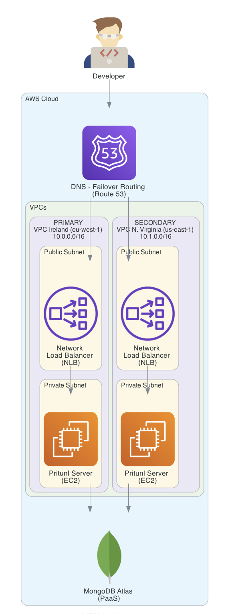

Pritunl VPN is a highly secure and scalable VPN solution, ideal for cloud infrastructure environments. In this setup, Pritunl is deployed within an AWS Virtual Private Cloud (VPC), residing in a private subnet to enhance security and restrict public access. To allow external clients to securely connect to the VPN, an AWS Network Load Balancer (NLB) is configured to route traffic to the Pritunl server. The NLB efficiently handles incoming client connections by distributing traffic across multiple availability zones, ensuring high availability and fault tolerance.

This configuration provides a secure gateway for remote users to access AWS resources, combining the benefits of a private subnet’s isolation with the NLB’s ability to handle heavy client loads while maintaining low-latency performance.

Key Features:

Private Subnet: Keeps the Pritunl server isolated from direct internet exposure.
Network Load Balancer (NLB): Efficiently exposes Pritunl to the public while distributing traffic and ensuring high availability.
Security: Combines the inherent security of AWS VPCs with Pritunl's robust VPN capabilities to protect sensitive data.

